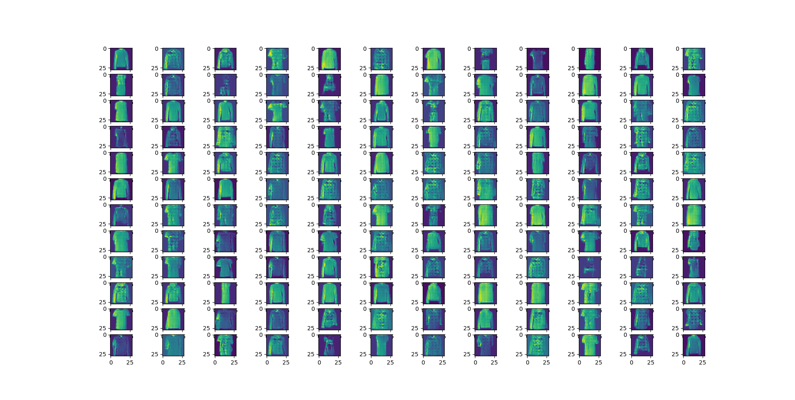

# A learning Project for GANs 

# MNIST Fashion gnerative model

## Starting out:
    - Wanted to use a pytorch dataset to work on image generation using a GAN
    - found larger batch size helps because models train
    - realized that relu + dropout is not best practice compared to leakyrelu
    - realized that method of upsampling was not so good along with the fact that
    - trained a model with too high of a loss ration, got  where the snapshots are taken every 10 epochs
    - trained model with lower loss ratio (0.0002) and got better results. 
        - there are also sample outputs  and 

## Next Steps:
    - create personal dataset for image generation

## NOTE:
    - wanted to do some ML that would run better on GPU
    - single epoch using current commit:
        - CPU: 213 Seconds
        - GPU: 30 Seconds

# DND Map Maker (mapmaker)
    - dataset is really small ~360 images (from map of the week)
        - pruned a few by hand after downloading the script
        - more data might be needed
        - though, if the gan is really stable, it may be able to use more epochs with the same dataset
        - the dataset is pretty diverse, but I am not sure if that helps or not
    - Was getting some divergences, reduced discriminator learning rate from 0.001 -> 0.0004
    - At one point, the last layer of the generator had a larger kernel size and a larger padding, changed to lower padding and kernel
    - took some online advice and the labels for the real images are "0.9" not 1
    - added batch normalization to generator model
    - using tanh activation for the image output, since images are 0-1 created with (X + 1) / 2
        - thinking about applying 2*X - 1 to training images, but undecided
    - have added ability but have not tried adding noise (15%) to train and generated images before passing to the discriminator during training
    - desired output image size may just be too large
    - had to strike a balance with making the model fit on 24GB of RAM
        - used large stride to upsample image size
        - only had latent space of 3x20x20 -> linear layer -> 16x64x64
        - so upsizing from 64x64 to ~1k over the two transpose layers
        - use one convolution to go down from ~1000x1000 to 750x750 
    - not sure if large stride is best way to upsample
    - had gut feeling that I wanted to have at least one layer that reduces input -> output size
    - not sure if I should have any equal input and output layers
        - might want to add one more layer at the end of the generator for better smoothing?