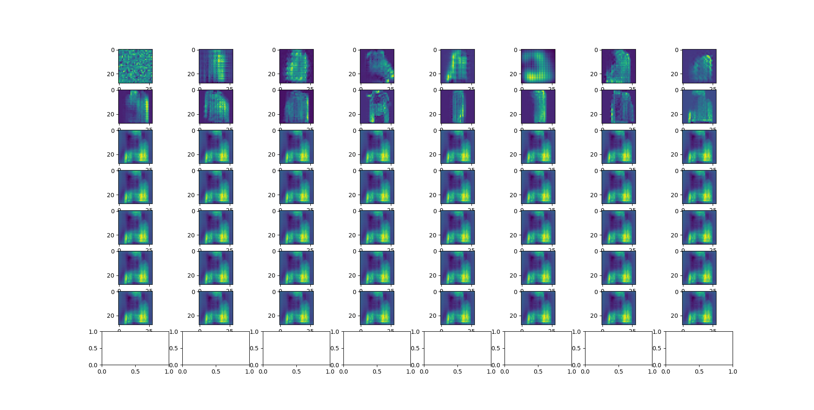
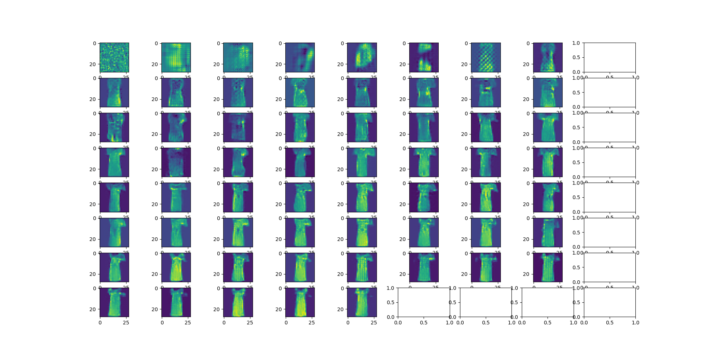

# A learning Project for GANs

# Starting out:
    - Wanted to use a pytorch dataset to work on image generation using a GAN
    - found larger batch size helps because models train
    - realized that relu + dropout is not best practice compared to leakyrelu 
    - realized that method of upsampling was not so good along with the fact that 
    - trained a model with too high of a loss ration, got  where the snapshots are taken every 10 epochs
    - trained model with lower loss ratio (0.0002) and got better results. 
        - there are also sample outputs [here](outputs/Working_model_1_sample_outputs_1.png) and [here](outputs/Working_model_1_sample_outputs_2.png)
    
# Next Steps:
    - create personal dataset for image generation

# NOTE:   
    - wanted to do some ML that would run better on GPU 
    - single epoch using current commit:
        - CPU: 213 Seconds
        - GPU: 30 Seconds